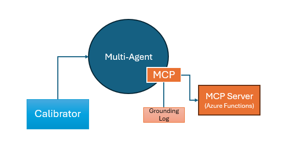
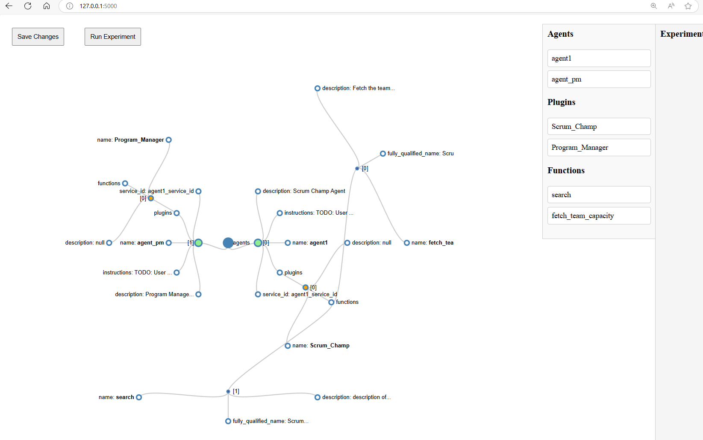

# Multi-Agent Auto Calibrator
Automatically Calibrate Semantic Kernel Project Code. 

This is a tool to work with popular Multi-Agent frameworks  to continuously improve Multi-Agent system with speed and quality

The Multi-Agent calibrator could help,
- Visualize the Multi-Agent structure, convey the logic to Developer and business stakeholder
- Help to speed up the feedback addressing, by generating N variant ideas, and evaluate with ground truth with regression
- Track the quality continuously with number

# Conceptual overview of the Semi-Auto Calibrator
This research breaks down the Multi-Agent RAG system into modifiable or re-assemble components, making it eligible for generating component variants, and topology variants. The algorithm to do semi-auto calibration is to first (semi) auto generate N component variant or topology variant for a given use case. N variants make an experiment. To run the experiment, the calibrator updates multi-agent architecture object for each variant. Evaluate with a calibrator test set which includes the fields to do evaluation, i.e., expected answers, etc. By gathering all the evaluation metrics, the calibrator suggests the best variant. Then the developers could check in the code with suggested modifications and update the service automatically.

# Features

- [x] Abstract Semantic Kernel Component to be calibratorable
- [x] Render Multi-Agent Topology with UI as a graph
- [x] Generate variant by making changes on the UI, and save variant list
- [x] Run experiment against test suite and identify the best variant
- [x] Render experiment logs on UI to show the progress
- [ ] Drag and drop Components to rebuild Multi-Agent topology
- [ ] Support C# version Semantic Kernel
- [ ] Support AG2
- [ ] Create Multi-Agent project from scratch, and code generation
- [ ] Create Multi-Agent project with AI via simple chat
- [ ] Deploy on server
- [ ] Auto Calibration
- [ ] Gamify

# Local Development Setup 

python -m venv .venv
.venv\Scripts\Activate.ps1

# Project

> This repo has been populated by an initial template to help get you started. Please
> make sure to update the content to build a great experience for community-building.

As the maintainer of this project, please make a few updates:

- Improving this README.MD file to provide a great experience
- Updating SUPPORT.MD with content about this project's support experience
- Understanding the security reporting process in SECURITY.MD
- Remove this section from the README

## Contributing

This project welcomes contributions and suggestions.  Most contributions require you to agree to a
Contributor License Agreement (CLA) declaring that you have the right to, and actually do, grant us
the rights to use your contribution. For details, visit https://cla.opensource.microsoft.com.

When you submit a pull request, a CLA bot will automatically determine whether you need to provide
a CLA and decorate the PR appropriately (e.g., status check, comment). Simply follow the instructions
provided by the bot. You will only need to do this once across all repos using our CLA.

This project has adopted the [Microsoft Open Source Code of Conduct](https://opensource.microsoft.com/codeofconduct/).
For more information see the [Code of Conduct FAQ](https://opensource.microsoft.com/codeofconduct/faq/) or
contact [opencode@microsoft.com](mailto:opencode@microsoft.com) with any additional questions or comments.

## Trademarks

This project may contain trademarks or logos for projects, products, or services. Authorized use of Microsoft 
trademarks or logos is subject to and must follow 
[Microsoft's Trademark & Brand Guidelines](https://www.microsoft.com/en-us/legal/intellectualproperty/trademarks/usage/general).
Use of Microsoft trademarks or logos in modified versions of this project must not cause confusion or imply Microsoft sponsorship.
Any use of third-party trademarks or logos are subject to those third-party's policies.
